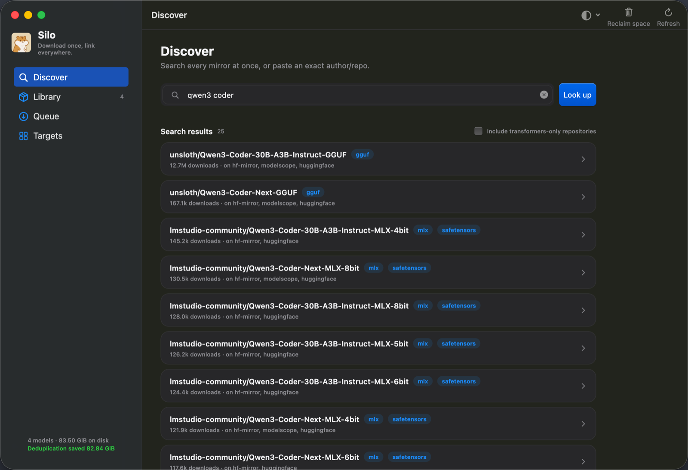
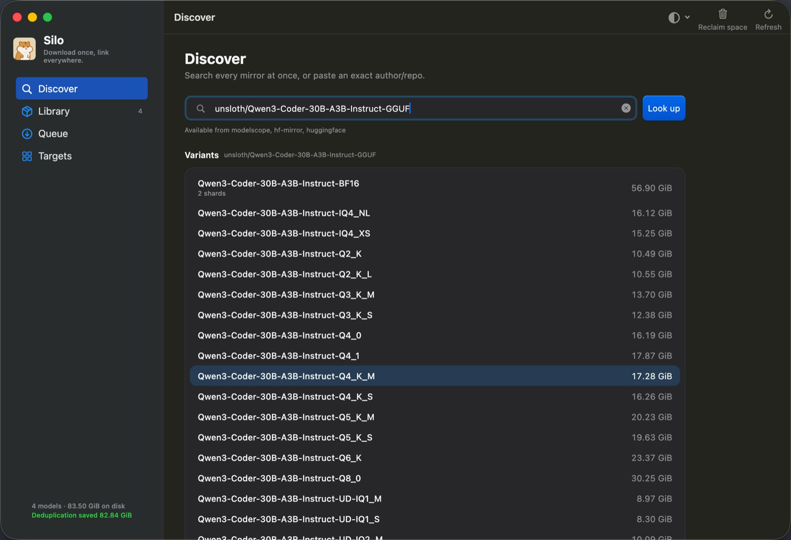
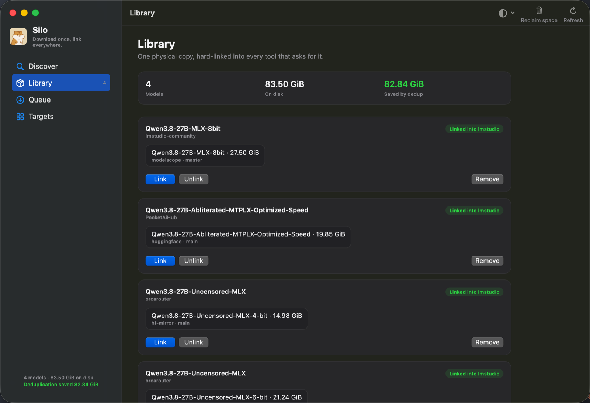

<p align="center">
  
</p>

<h1 align="center">Silo</h1>

<p align="center">
  <a href="https://github.com/LinXunFeng/"></a>
  <a href="https://github.com/LinXunFeng/silo/releases/latest"></a>
  <a href="https://github.com/LinXunFeng/silo"></a>
  
</p>

Language: English | [中文](README-zh.md)

A local model library for macOS. **Download once, link everywhere.**

Running LM Studio, Ollama and llama.cpp side by side means storing the same 7B
model three times — 15 GB to hold 5 GB of weights. Silo keeps one physical copy
in a content-addressed store and hard-links it into each tool's directory. Every
tool sees an ordinary file; the disk gives up the space once.

Downloading fast from China is the reason this started, but it is not what the
project is. Silo is a library manager that happens to have a good downloader.

## 📸 Screenshots

<table>
  <tr>
    <td width="33%"></td>
    <td width="33%"></td>
    <td width="33%"></td>
  </tr>
  <tr>
    <td align="center">One search box, every source at once — GGUF and MLX builds surfaced instead of buried.</td>
    <td align="center">Paste an exact <code>author/repo</code> and every quant is there, sized, with shards grouped into one.</td>
    <td align="center">What is on disk, which tools it is linked into, and what deduplication gave back.</td>
  </tr>
</table>

## ☕ Support me

[](https://ko-fi.com/T6T4JKVRP) [](https://cdn.jsdelivr.net/gh/FullStackAction/PicBed@resource20220417121922/image/202303181116760.jpeg)

## 🔨 Feature

- [x] **One copy on disk.** A content-addressed store holds the bytes once and
      hard-links them into every tool that wants them — same inode, no extra
      space, and each tool still sees an ordinary file.
- [x] **A downloader built for slow links.** Ranged parallel chunks, resume
      across restarts and reboots, SHA-256 verification, rate limiting.
- [x] **Mirrors that fail over.** Both hubs publish the same digest for the same
      file, so a download can switch mirrors mid-flight and still verify.
- [x] **Picks the fastest mirror by measuring it.** Not by trusting the order
      they are listed in — real bytes are sampled before choosing.
- [x] **One search box for every source.** Keyword search across all sources at
      once, with the GGUF and MLX builds surfaced instead of buried.
- [x] **Sharded models stay whole.** Multi-part weights and the `mmproj-*.gguf`
      a vision model needs are grouped into one selectable variant.
- [x] **A serial queue.** Downloading two models at once is slower than doing
      them in turn, so the queue runs one at a time — and survives Ctrl-C.
- [x] **Both a window and a terminal.** The macOS app and the `silo` command
      share the same engine and the same library.

## 🎀 Support

**Sources**

- [x] HuggingFace
- [x] hf-mirror
- [x] ModelScope
- [x] Custom endpoints

**Targets**

- [x] LM Studio
- [ ] Ollama
- [ ] llama.cpp
- [ ] ComfyUI
- [ ] HuggingFace cache (transformers / vLLM)

## 📦 Installing

### Homebrew

The app and the command come from the same tap, and it strips the quarantine
attribute for you — nothing to do after installing.

```bash
brew tap linxunfeng/tap

brew install --cask linxunfeng/tap/silo   # the app
brew install linxunfeng/tap/silo          # the CLI
```

`--cask` is what tells the two apart: the formula and the cask share a name, so
without it Homebrew installs the command.

```bash
brew upgrade --cask silo   # the app
brew upgrade silo          # the CLI
```

### App

Download the `.dmg` from [Releases](https://github.com/LinXunFeng/silo/releases/latest)
and drag Silo into Applications.

The builds are neither signed nor notarised, so Gatekeeper blocks the first
launch. Strip the quarantine attribute to get past it:

```bash
xattr -dr com.apple.quarantine /Applications/Silo.app
```

### CLI

Download the tarball for your architecture from the same release — `uname -m`
says which one is yours:

```bash
tar -xzf silo-*-macos-$(uname -m).tar.gz
xattr -d com.apple.quarantine silo 2>/dev/null || true
mv silo ~/bin/silo
```

Or build it from source:

```bash
dart pub get
dart compile exe packages/cli/bin/silo.dart -o ~/bin/silo
```

## 🚀 Usage

The app does all of this with a window. Its one search box takes either a
keyword or an exact `author/repo`, and does the sensible thing with each —
search results you can click through, or straight to the variant list.

```bash
# Don't know the exact id? Search every source at once.
# Only GGUF and MLX repositories are shown; --all for the rest.
silo search qwen3 coder

# What does this repo offer, and which mirrors carry it?
silo inspect Qwen/Qwen2.5-0.5B-Instruct-GGUF

# Which mirror is actually fastest right now?
silo sources --probe Qwen/Qwen2.5-0.5B-Instruct-GGUF

# Pull it in (defaults to Q4_K_M) and hard-link it into LM Studio.
# Several models queue up and run one at a time.
silo add Qwen/Qwen2.5-0.5B-Instruct-GGUF Qwen/Qwen2.5-1.5B-Instruct-GGUF

# Ctrl-C is safe: the queue and the partial bytes both survive
silo queue --resume

# What is in the library, and what did dedup save?
silo ls

# What do my tools already have?
silo scan

# Take a model out of a tool but keep it in the store
silo unlink Qwen/Qwen2.5-0.5B-Instruct-GGUF --from lmstudio

# Forget a model (unlinks it too), then reclaim the space
silo rm Qwen/Qwen2.5-0.5B-Instruct-GGUF
silo gc
```

Useful global flags: `-j` connections (default 8), `--limit 5M` to throttle,
`--source modelscope` to pin a mirror, `--store` to relocate the library.

## 🧱 Architecture

```
Source                    Engine                    Target
──────────────────        ──────────────────        ──────────────────
HuggingFace               range requests            LM Studio
hf-mirror                 parallel chunks           llama.cpp
ModelScope                resume via sidecar        Ollama
(custom endpoints)        SHA-256 verification      ComfyUI / HF cache
                          rate limiting
```

The engine in the middle knows nothing about models. It moves bytes from a URL
into a file. Sources and targets are plugins on either side, so adding a mirror
never means touching a target, and adding a tool never means touching the
downloader.

```
packages/core    engine, sources, store, targets — zero runtime dependencies
packages/cli     the `silo` command
apps/silo        Flutter macOS app
```

`silo_core` deliberately has no package dependencies: `dart:io` and a hand-rolled
streaming SHA-256, pinned against NIST vectors and the system `shasum`.

## 🚢 Releasing

Version numbers come out of the commit history, so commits follow
[Conventional Commits](https://conventionalcommits.org). One product, one
number: `silo_core`, `silo_cli` and the app are versioned in lockstep.

```bash
dart run melos run release   # bump the workspace, write the changelogs, tag v<version>
git push --follow-tags       # the tag is what builds the DMG and cuts the release
```

```
Local                                    GitHub Actions
─────────────────────────────────        ─────────────────────────────────
conventional commits
        │
        ▼
melos run release
  ├ melos version --all            one version across all three packages,
  │                                dependents' constraints move with it
  ├ CHANGELOG × 4                  one per package, plus the root summary
  ├ chore(release) commit
  └ git tag v0.1.1
        │
        ▼
git push --follow-tags ──────────▶  on: push tags ['v*']
                                           │
                                       check      analyze + test
                                           │
                                       meta       version read off the tag,
                                           │      checked against the pubspec
                                ┌──────────┴──────────┐
                              cli                    app
                       arm64 + x86_64          flutter build macos
                       → a tar.gz each         → hdiutil → DMG
                                └──────────┬──────────┘
                                        release
                                SHA256SUMS + gh release create
                                           │
                                         tap        checksums →
                                                    LinXunFeng/homebrew-tap,
                                                    which opens its own bump PR
```

melos stops at the tag. Everything past it — the two CLI tarballs, the DMG, the
checksums, the release itself, the Homebrew bump — is the workflow's job.

A CLI tarball per architecture rather than one universal binary: `dart compile
exe` appends the AOT snapshot past the end of the Mach-O, and `lipo` copies only
the Mach-O, so a lipo'd `silo` starts up as the bare Dart VM.

The `tap` job needs `TAP_APP_ID` and `TAP_APP_PRIVATE_KEY` — a GitHub App with
contents and pull-request write on the tap. `GITHUB_TOKEN` cannot reach another
repository.

`melos run analyze` and `melos run test` are exactly what CI runs, so they are
the two commands worth running before pushing.

## 📄 License

[Apache License 2.0](LICENSE) © 2026 LinXunFeng

## 🖨 About Me

- GitHub: [https://github.com/LinXunFeng](https://github.com/LinXunFeng)
- Email: [linxunfeng@yeah.net](mailto:linxunfeng@yeah.net)
- Blogs: 
  - 全栈行动: [https://fullstackaction.com](https://fullstackaction.com)
  - 掘金: [https://juejin.cn/user/1820446984512392](https://juejin.cn/user/1820446984512392) 


